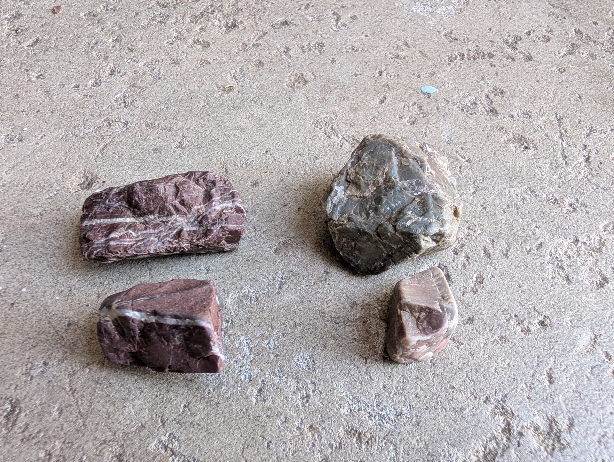
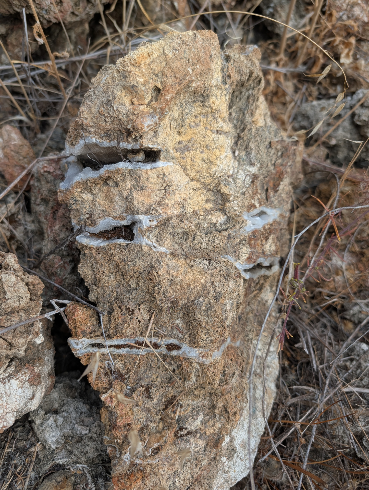
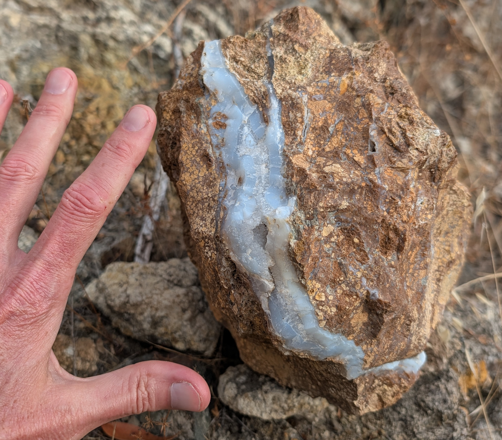

# Rock Hounding
Notes on rock collecting. Will mostly be about northern California and cover small rocks fit for a small tumbler

## Places visited nearby San Jose

### 37.21861524821486, -121.73976107192998
Near Coyote Ranch in South San Jose. Just a pile of rocks off the Coyote Creek trail. Seems to have a bunch of red and green jasper, which is appearing to be everywhere in any creek with rocks in the area. Also pulled into a trail parking lot a couple miles north of here along Monterey road where the trail is next to it. The dry river bed here had more of the same.

### 37.232488882605416, -121.89773939271494
Owned by the local water company, it is listed as a BMX park. There are giant boulders of what appear to be green jasper in the park. If you go to the creek and walk until you see some rocks, it seems to be more red and green jasper.  Above and here, they look like this, red on the left and green on the right:  

## Morgan Hill
### 37.16434071808764, -121.61836468418912
To get here, I parked in the small lot labeled on Google Maps as *Hiking Spot MH - JC*. Then I went on the hiking path, keeping to the right until there were signs of a creek going from the pond to the lake. There was a dry creek bed and deer trails that I could then follow toward the lake. There were no marked trails, but this was the best I could do without going all the way to the boat ramp. It's not an easy route. When I got to the lake bed area (the lake was low at the end of the season) I found some rocks that I thought were interesting, like these:  
  
  
These were way too big for the tumbler and really too big to carry around, so I left them. I assume this is what eventually produces the white/blue agate that was noted for the south east end of the lake, but I could not find any of that by itself

### 37.153766627980126, -121.59323702827238
To get here, I parked at a pull-off from the road near the closed picnic area marked as *Woodchoppers Flat Picnic Area* on Google Maps. Then I just walked down to the river that feeds the lake. This area was okay with plenty of rocks, but it would probably be much better just after a rain has washed through and the water level is back down as the rocks in the river were full of algae and seaweed and so it was almost impossible to see anything neat in there. However, there were signs about mud which would probably be a problem just after a rain. Rocks here were more nicely worn with some red and green jasper, but less of the neat rocks like found in the spot above. Okay, but watch out for cow pies

## Tumbling notes
* I need to choose rocks with less deep pits and cracks. It takes too much tumbling to fully remove those
* Try to choose those without deep concave sections. The more like a sphere, the better
* The beginner, one speed, National Geographic tumbler uses about three watts while tumbling
* I tried four days first, but needed more time
* The included and first Amazon purchase of grits do not seem to be labeled with the exact grain. I think I would like a more course first grit and will probably try a site that offers a 30/60 first stage grit